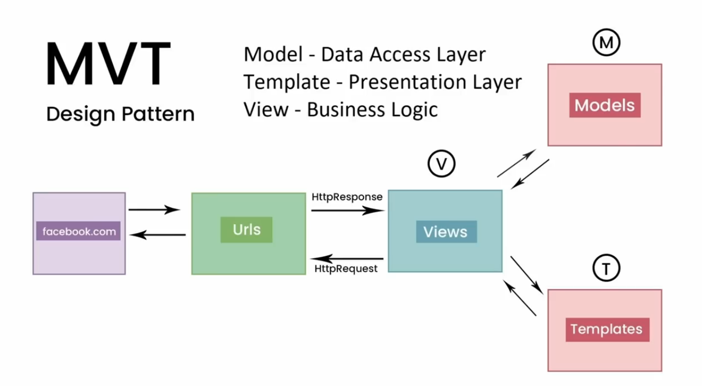
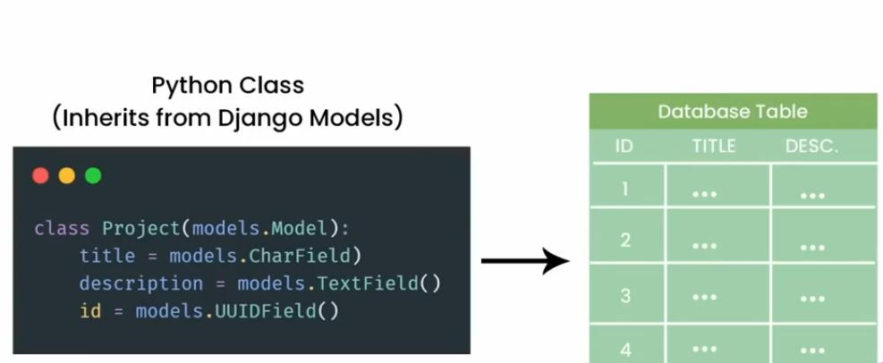
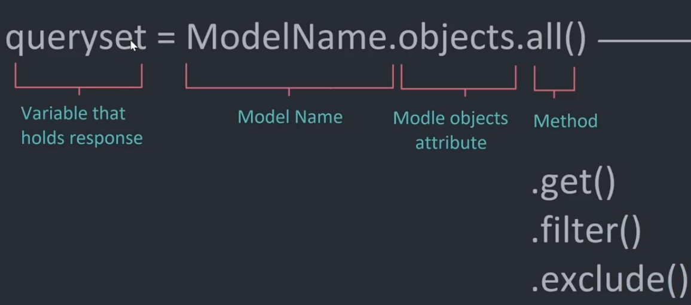

# Django

#### What is Django

- Python web framework
- Server side framework
- MVT(Model. View, Template) Design Pattern

#### MVT Pattern



- Steps
  1. Views: Matching URL will find the view
  2. Models: View gets data from models
  3. Templates: It will render a template and will send to the end user

#### Project Setup

```text
pip install virtualenv
virtualenv env
cd .\env\Scripts
activate
pip install django==4.0

<!-- Check django installed correctly -->
django-admin

django-admin startproject PROJECT_NAME
python manage.py runserver
python manage.py startapp base
```

- Everytime we create an app we need to link it to the main project

#### Migrations

```text
python manage.py makemigrations
python manage.py migrate
```

#### Models



#### Query Model


